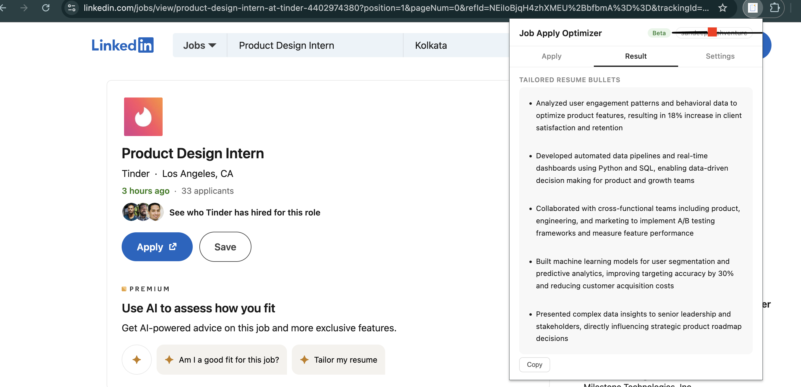

# Job Apply Optimizer

Chrome extension to automatically tailor your resume based on job descriptions.

## What it does
- Reads job descriptions from LinkedIn, Indeed, Naukri
- Rewrites resume bullets
- Generates cover letters
- Highlights missing keywords

## Screenshot (Example Output)

## Install (2 mins)

1. Click "Code" → Download ZIP
2. Unzip the file
3. Open Chrome → chrome://extensions
4. Enable Developer Mode
5. Click "Load unpacked"
6. Select the folder

## Notes
- Free to try (2 uses)
- Pro coming soon

## Feedback
Would love honest feedback on output quality.

